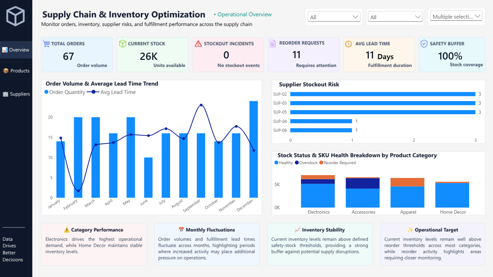

# 📦 Supply Chain & Inventory Optimization Dashboard | Power BI

An interactive Business Intelligence dashboard built with **Power BI, Power Query, and DAX** to analyze supply chain operations, inventory health, supplier performance, order activity, and fulfillment trends.

---

## 📌 Executive Summary

This project focuses on transforming raw supply chain transaction data into an interactive dashboard that provides a clear view of operational performance.

The dashboard brings together:

- 📦 Order volume and inventory levels
- 🚚 Average lead time trends
- 🏭 Supplier-level risk analysis
- ⚠️ Reorder requirements and stockout incidents
- 📊 Inventory health across product categories
- 📈 Operational KPI monitoring

The goal was to move beyond simply displaying numbers and create a dashboard that helps users identify areas requiring attention and ask better business questions.

---

## 🎯 Business Problem

Supply chain data can become difficult to interpret when orders, inventory, suppliers, and fulfillment metrics are analyzed separately.

This project addresses that challenge by bringing key operational metrics into a single interactive dashboard.

The dashboard helps answer questions such as:

- Which suppliers require closer monitoring?
- How does order volume change over time?
- How does average lead time fluctuate across months?
- Which product categories have healthier inventory positions?
- Where are reorder requirements appearing?

---

## ⚙️ Methodology

### 1️⃣ Data Preparation & Cleaning

The raw dataset was prepared using **Power Query**.

Key data preparation activities included:

- Cleaning and transforming fields
- Handling missing values
- Reviewing duplicate records
- Validating calculated fields
- Standardizing data types
- Preparing the dataset for reporting and analysis

### 2️⃣ Data Modeling & DAX

Power BI was used to build the analytical model and create DAX measures for the dashboard.

Key measures include:

- Total Orders
- Current Stock
- Stockout Incidents
- Reorder Requests
- Average Lead Time
- Safety Buffer Compliance

### 3️⃣ Dashboard Design

The dashboard was designed with a clean, minimalist layout focused on readability and business usability.

The final interface includes:

- KPI cards
- Monthly trend analysis
- Supplier-level analysis
- Category-level inventory analysis
- Interactive filtering

---

## 📊 Dashboard Features

### KPI Overview

The dashboard tracks six key operational indicators:

| KPI | Purpose |
|---|---|
| 📦 Total Orders | Monitor overall order activity |
| 📊 Current Stock | Track available inventory |
| ⚠️ Stockout Incidents | Identify stockout occurrences |
| 🔄 Reorder Requests | Monitor replenishment requirements |
| 🚚 Average Lead Time | Track fulfillment duration |
| 🛡️ Safety Buffer Compliance | Monitor inventory buffer coverage |

### Visual Analytics

**Order Volume & Average Lead Time Trend**  
Monthly comparison of order activity and average fulfillment lead time.

**Supplier Stockout Risk**  
Supplier-level view highlighting areas requiring closer monitoring.

**Stock Status & SKU Health by Category**  
Breakdown of inventory health across product categories.

### Interactive Controls

- 📅 Date / period filtering
- 🏷️ Product category filtering
- 🔎 Interactive dashboard exploration

---

## 🛠️ Tools & Skills

### Tools

- **Power BI Desktop**
- **Power Query**
- **DAX**
- **Canva**

### Technical Skills

- Data Cleaning & Transformation
- ETL
- Power Query
- DAX Measures
- Data Modeling
- KPI Development
- Data Visualization
- Dashboard Design
- Business Analysis
- Supply Chain Analytics

---

## 📈 Key Insights

The dashboard provides several operational insights, including:

- Electronics represents one of the stronger demand categories in the dataset.
- Order volume and average lead time fluctuate across months.
- Supplier-level analysis highlights vendors that require closer monitoring.
- Inventory status varies across product categories, helping identify areas requiring replenishment or further review.
- Current inventory levels provide visibility into available stock relative to defined safety-stock thresholds.

---

## 💡 Business Recommendations

Based on the dashboard analysis:

- Monitor suppliers showing higher levels of operational risk.
- Review categories with recurring reorder requirements.
- Track lead-time changes alongside order-volume fluctuations.
- Use inventory health indicators to support replenishment decisions.
- Continue monitoring safety-stock coverage to reduce potential supply disruptions.

---

## 🚀 Future Improvements

Potential extensions for the project include:

- 🔮 Inventory demand forecasting
- 🤖 Predictive analytics for stockout risk
- 🔎 Multi-page drill-through analysis
- 🗄️ Direct SQL database connectivity
- 📊 More advanced supplier performance metrics
- 📈 Automated reporting and refresh pipelines

---

## 📷 Dashboard Preview

---

## 📥 Power BI Project File

The repository includes the Power BI project file:

`Project_1_Supply_Chain_Optimization.pbix`

Open the file using **Power BI Desktop** to explore the dashboard, DAX measures, data model, and interactive filters.

---

## 🙌 Conclusion

This project demonstrates my ability to take raw operational data and transform it into an interactive Business Intelligence solution using **Power Query, DAX, and Power BI**.

The project strengthened my practical skills in:

**Data Cleaning → Data Modeling → DAX → Visualization → Business Insights**

More importantly, it reinforced the idea that effective dashboards should not only present data — they should help users understand **what deserves attention and what questions to ask next.**

---

### 👤 Project Focus

**Supply Chain Analytics | Inventory Optimization | Business Intelligence | Power BI**
